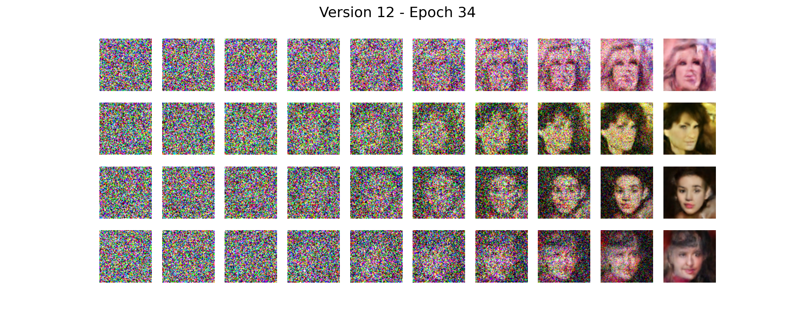
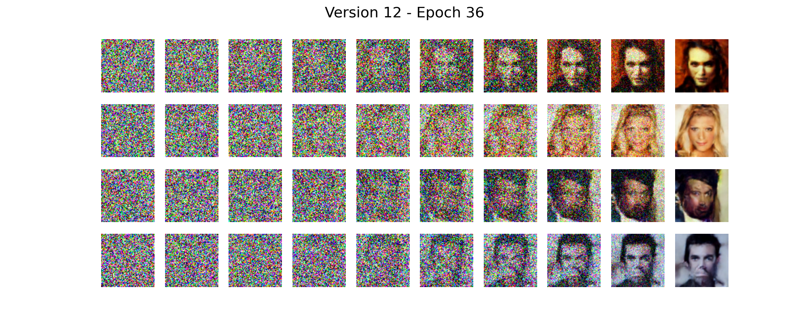
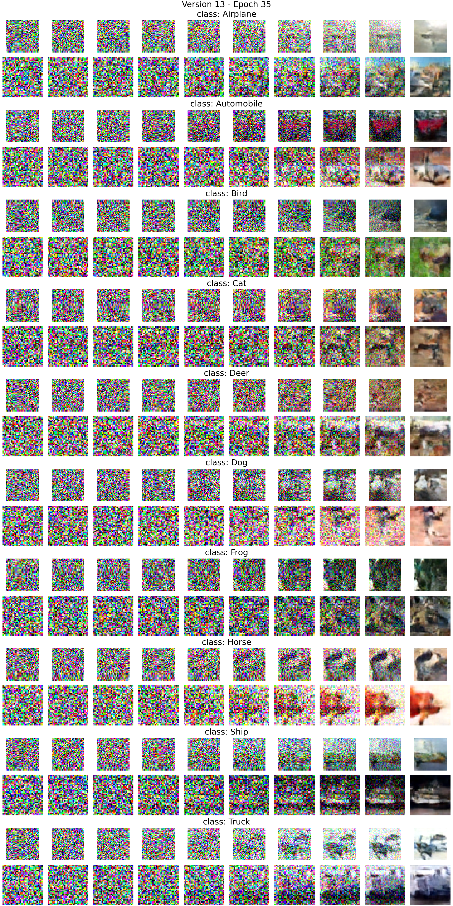
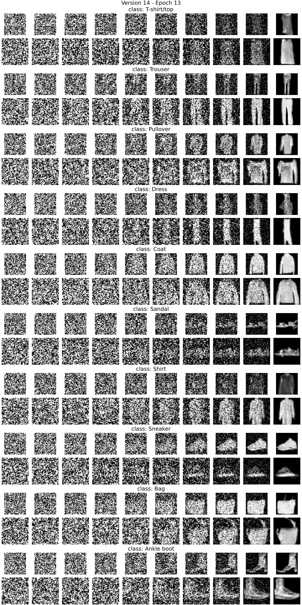
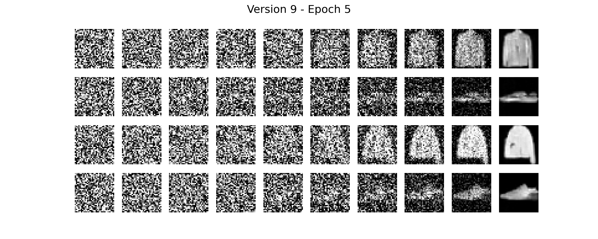

# DDPM Model for Image Generation and Training
This repository is a simple demo implementation of the DDPM (Denoising Diffusion Probabilistic Model) model for image generation and training.
Based on the 2020 paper [Denoising Diffusion Probabilistic Models](https://arxiv.org/abs/2006.11239)

## Features
- Diffusion model implementation using a custom UNet model.
- Support conditional (classes specified) and unconditional generation.
- Support for image generation from a pre-trained model.
- Support for training from scratch or continuing from a checkpoint.
- Customizable dataset, image size, batch size, and other training parameters via command-line arguments.

## Table of Contents
1. [Results](#results)
2. [Installation](#installation)
3. [Usage](#usage)
4. [Command-line Arguments](#command-line-arguments)
5. [Examples](#examples)
6. [Project Structure](#project-structure)

## Results
### Celeb dataset: 64x64 images (Unconditional Generation).



### Cifar10 dataset: 32x32 images (Conditional Generation).


### Fashion mnist: 32x32 images (Conditional Generation).
 

### Fashion mnist: 32x32 images (Unconditional Generation).



## Installation

### Clone the Repository
```bash
git clone https://github.com/EzzatEsam/TestingDiffusionModel.git
```

### Install Dependencies
Make sure you have [PyTorch](https://pytorch.org/) installed. You can install the required Python packages using:
```bash
pip install -r requirements.txt
```
### Modify dataset locations
You will need to manually modify the dataset locations in the [loader.py](DiffusionTest/loader.py) file.

## Usage

### Generating Images
To generate images from a pre-trained model, simply run:
```bash
python main.py --img_size 64 --version {version} --saving_path {saving_path} --start_epoch {start_epoch}
```

This will load a pre-trained model (starting from the specified epoch) and generate a set of images.

### Training the Model
If you want to train the model, use the `--training` flag:
```bash
python script.py --training --dataset celeb --img_size 64 --batch_size 64 --start_epoch 0 --epochs 1001 --learning_rate 1e-4 --save_every_n 2
```

The model will be trained for the specified number of epochs, and checkpoints will be saved at regular intervals.

## Command-line Arguments

| Argument           | Type    | Default                                              | Description                                                                                            |
|--------------------|---------|------------------------------------------------------|--------------------------------------------------------------------------------------------------------|
| `--device`         | `str`   | `"cuda"` (if available)                              | Device to run the model on (`cuda` or `cpu`).                                                           |
| `--training`       | `flag`  | `False`                                              | If set, the model will be trained. If not, images will be generated.                                    |
| `--saving_path`    | `str`   | `"/teamspace/studios/this_studio/runs"`              | Directory where the model checkpoints and images will be saved.                                         |
| `--version`        | `int`   | `0`                                                 | Version number for saving models and images.                                                            |
| `--dataset`        | `str`   | `"celeb"`                                            | Dataset to use for training or image generation (`"celeb"` or `"bridge"` or `"cifar10"` or `"fashion"` or `"cifar10"`).                               |
| `--img_size`       | `int`   | `64`                                                 | Size of the images (both height and width).                                                             |
| `--batch_size`     | `int`   | `64`                                                 | Batch size for training and validation.                                                                 |
| `--start_epoch`    | `int`   | `0`                                                 | Starting epoch for training, useful for resuming from a checkpoint.                                     |
| `--epochs`         | `int`   | `1001`                                               | Maximum number of epochs to train the model.                                                              |
| `--save_every_n`   | `int`   | `2`                                                  | Save model checkpoint every `n` epochs during training.                                                 |
| `--learning_rate`  | `float` | `1e-4`                                               | Learning rate for the optimizer.                                                                        |
| `--conditional`  | `flag`  | `False`                                              | If set, the model will be trained with conditional generation.                                     |

## Examples

### Image Generation (Default Settings)
```bash
python script.py  --version {version} --saving_path {saving_path} --start_epoch {start_epoch}
```

### Training the Model
```bash
python script.py --training --dataset celeb --img_size 64 --batch_size 64 --start_epoch 33 --epochs 1001 --learning_rate 1e-4 --save_every_n 2
```

### Custom Device (CPU)
```bash
python script.py --device cpu --training --dataset celeb --img_size 64 --batch_size 32 --start_epoch 0 --epochs 500
```

## Project Structure

```bash
.
├── DiffusionTest/
│   ├── model.py              # Contains the SmallUNetWithEmb model definition
│   ├── diffusion.py          # Contains the diffusion process and generation logic
│   ├── loader.py             # Contains dataset loading logic
│   ├── utils.py              # Utility functions like saving images
│   ├── __init__.py           # Package initialization
├── main.py                 # Main script to run training or image generation
├── requirements.txt          # Python dependencies
├── README.md                 # This README file
```

## Contributing

Contributions are welcome! Please open an issue or submit a pull request for any improvements or bug fixes.

## License

This project is licensed under the MIT License. See the [LICENSE](LICENSE) file for details.

